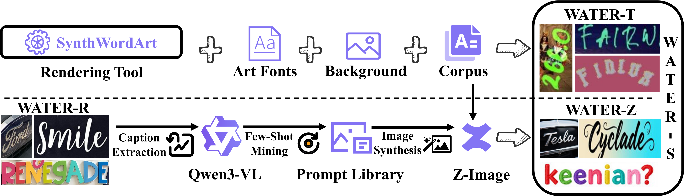
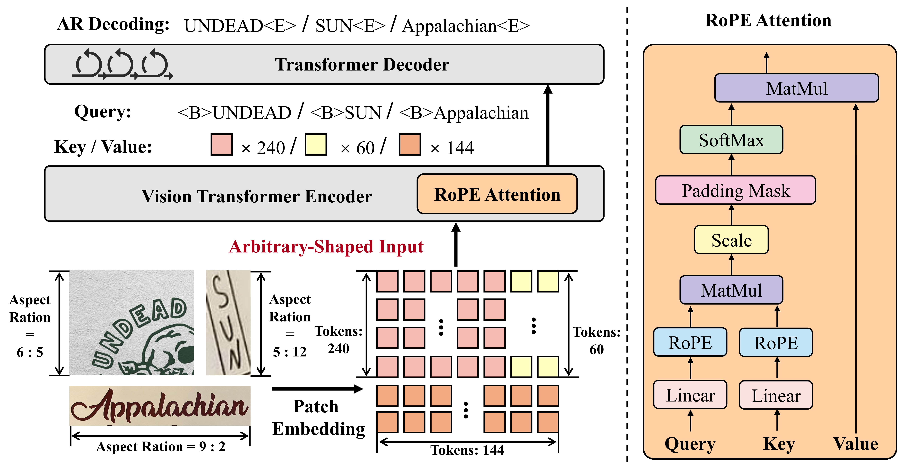

<div align="center">

# WATER: Advancing WordArt-Oriented Scene Text Recognition

### Datasets and Methods

**ECCV 2026**

[Paper (arXiv)]() | [Model Code](https://github.com/YesianRohn/OpenOCR-WATERec) | [Dataset](https://huggingface.co/datasets/Yesianrohn/WATER-Data) | [Captions](https://huggingface.co/datasets/Yesianrohn/WATER-Z_Captions)

</div>

---

> **TL;DR:** We advance WordArt-oriented scene TExt Recognition (WATER) from both data and model perspectives. We construct **WATER-S**, a 2M-scale synthetic artistic text dataset, and propose **WATERec**, a strong STR baseline supporting arbitrary-shaped inputs. Our approach achieves **90.40%** accuracy on WordArt-Bench, the first result exceeding 90%, surpassing both general-purpose and OCR-specialized VLMs by a large margin.

<div align="center">

</div>

## News

- **[2026/06]** Code and data are released.
- **[2026/06]** Paper is accepted by ECCV 2026.

## Highlights

- **WATER-S**: A 2M-scale synthetic artistic text dataset consisting of two complementary subsets:
  - **WATER-T** (1M): Tool-rendered via our [SynthWordArt](SynthWordArt/) engine with 11,250 artistic fonts
  - **WATER-Z** (1M): Generated by combining Qwen3-VL prompt mining + [Z-Image](Z-Image/) synthesis
- **WATER-R**: A carefully deduplicated real training set (3.2M) from Union14M-L, WordArt, and WAS-R
- **WATERec**: An STR baseline with NaViT-like encoder (RoPE) for arbitrary-shaped inputs + AR decoder
- **90.40%** accuracy on WordArt-Bench — **first** to exceed 90%, outperforming HunyuanOCR (81.54%) and other VLMs

## Repository Structure

```
WATER/
├── README.md
├── assets/                        # Figures for README
├── SynthWordArt/                  # WATER-T: artistic text rendering engine
│   ├── README.md
├── prompts/                       # WATER-Z: prompt mining pipeline
│   ├── caption_mining.py          # Step 1: mine captions from artistic text images
│   └── fewshot_expansion.py       # Step 2: expand prompts via few-shot generation
├── Z-Image/                       # WATER-Z: image generation with Z-Image
│   └── gen_zimage.py              # Multi-GPU parallel generation script
└── eval_vlm/                      # VLM evaluation on WordArt-Bench
    ├── get_acc.py                 # Accuracy computation
    ├── get_wrong.py               # Error case extraction
    ├── infer_qwen3.py             # Qwen3-VL-8B
    ├── infer_intern.py            # InternVL3.5-8B
    ├── infer_got.py               # GOT-OCR2.0
    ├── infer_deepseekocr.py       # DeepSeek-OCR-2
    ├── infer_paddleocrvl.py       # PaddleOCR-VL
    ├── infer_paddleocr.py         # PP-OCRv5
    ├── infer_hunyuanocr.py        # HunyuanOCR
    └── infer_nemotron.py          # Nemotron-VL-8B
```

**External Repositories:**

| Component | Link | Description |
|-----------|------|-------------|
| **WATERec Model** | [OpenOCR-WATERec](https://github.com/YesianRohn/OpenOCR-WATERec) | Model training & inference (based on [OpenOCR](https://github.com/Topdu/OpenOCR)) |
| **WATER-Data** | [HuggingFace](https://huggingface.co/datasets/Yesianrohn/WATER-Data) | WATER-S, WATER-R, fonts, benchmarks |
| **WATER-Z Captions** | [HuggingFace](https://huggingface.co/datasets/Yesianrohn/WATER-Z_Captions) | 273K prompt templates for WATER-Z generation |


## Visualization

<div align="center">

<p><em>Pipelines of WATER-T (top) and WATER-Z (bottom).</em></p>
</div>

<div align="center">

<p><em>Architecture of WATERec: NaViT-like encoder with RoPE + AR decoder.</em></p>
</div>

## Citation

If you find this work useful, please cite:

```bibtex
@inproceedings{water2026eccv,
  title     = {Advancing WordArt-Oriented Scene Text Recognition: Datasets and Methods},
  author    = {Ye, Xingsong and Du, Yongkun and Zhang, Jiaxin and Zhang, Haojie and Sun, Chong and Li, Chen and Lyu, Jing and Chen, Zhineng},
  booktitle = {European Conference on Computer Vision (ECCV)},
  year      = {2026}
}
```

## Acknowledgements

- [OpenOCR](https://github.com/Topdu/OpenOCR) — Model training framework
- [UnionST](https://github.com/YesianRohn/UnionST) — Synthetic engine reference
- [Union14M](https://github.com/Mountchicken/Union14M) — Real dataset curation
- [WordArt](https://github.com/xdxie/WordArt) — WordArt benchmark
- [Z-Image](https://github.com/Tongyi-MAI/Z-Image) — Image generation for WATER-Z
- [Qwen3-VL](https://github.com/QwenLM/Qwen3-VL) — VLM for prompt mining

## License

This project is released under the [Apache 2.0 License](LICENSE).

**Font License Disclaimer**: The artistic fonts used in WATER-T are collected from open-source platforms under their respective licenses (OFL, Apache, Creative Commons, etc.). If any font violates its license terms, please contact us and we will remove it promptly.
